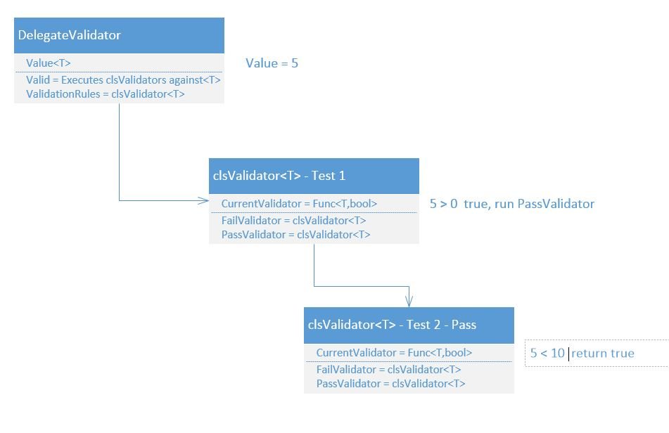

# Delegates-Part-2
Using delegates as a dynamic validator

## Introduction

In Part one, I covered some basics of delegates and using them to group, delay
and change the order of functions which were added to a list of delegates dynamically. 

Here, I will demonstrate the ability to use delegates and generics to create a validator which
will validate various types and classes.

The program itself doesn’t do much, but you can place break points in the code to unit test the
ideas and concepts.

### Background
The validator includes two basic classes.
(Form2 Region - Example Helper Classes)

clsValidator
This is a class which contains a reference to a Func<T,bool> delegate called CurrentValidator and a reference to two clsValidators, FailValidator and
PassValidator.

If the CurrentValidator is successful, the PassValidator is called, if false the FailValidator is called.
Using this, you can create a tree like structure of nodes to be traversed based on true or false values.
It’s defined as:

```csharp
  class clsValidator<T>
   {
     public Func<T, bool> CurrentValidator { get; set; }
     public clsValidator<T> FailValidator { get; set; }
     public clsValidator<T> PassValidator { get; set; }
   }
```
DelegateValidator
It contains the following properties:

Value – type of T can accept any type
ValidationRules which contains a root node of clsValidator objects
And a Boolean function of Valid() which is called to use the Validation rules to validate
the Value

It is defined as:
```csharp
 class DelegateValidator<T>
 {
   public T Value { get; set; }
   public clsValidator<T> ValidationRules { get; set; }
   internal bool Valid()
   {
     //Seed the recursive routine with root node
     return Valid(ValidationRules, Value);
     }
   /// <summary>
   /// This is a recursive call which traverses the clsValidator nodes.
   /// </summary>
   /// <param name="currval">Validator function</param>
   /// <param name="RecurseValue">Value</param>
   /// <returns>true or false</returns>
   private bool Valid(clsValidator<T> currval, T RecurseValue)
   {
     //invoke the Func<T,bool> to test the Value
     bool success = currval.CurrentValidator.Invoke(RecurseValue);
     if (success)
     {
     if (currval.PassValidator != null)
     return Valid(currval.PassValidator, RecurseValue);
     }
     else
     {
     if (currval.FailValidator != null)
     return Valid(currval.FailValidator, RecurseValue);
     }
     return success;
   }
 }
```

### Using the Code
#### (Code Region One, Example One)
I define the following to test an integer value:

```csharp
 private void btnExample1_Click(object sender, EventArgs e)
 {
     //We are going to be testin integer values
     DelegateValidator<int> dint = new DelegateValidator<int>();
     bool retval;
     //Create a linked list of clsValidator,
     //Current validator test to see if Value is greater than 1,
     //if so then next validator (PassValidator) tests to see if Value is also < 10
     dint.ValidationRules = new clsValidator<int> { 
        CurrentValidator = (i) => { return i > 0; }, 
        PassValidator = new clsValidator<int> { 
        CurrentValidator = (i) => { return i < 10; } 
        } 
      };
     dint.Value = -1;
     retval = dint.Valid(); //False, less then 0 - fails first validator,
     //never goes to second validator
     dint.Value = 5;
     retval = dint.Valid(); //True, greater then 0 and then 10 - both validators return true
     dint.Value = 50;
     retval = dint.Valid(); //False, greater then 0 and greater then 10 - first validator passes, second fails.
 }
```

Here is a diagram which illustrates what is shown in code:

 

Notice that you do not need to create a validator for all paths, only what you want to further
test. So when the first validation test fails, we simply return fail as a return from Valid().

#### (Region Two, Example Two)
I define the following to test a string value, the top part uses the inline syntax shown in
example one, the second half shows using functions defined outside of the click event scope.

```csharp
 private void btnExample2_Click(object sender, EventArgs e)
 {
     //First test - defining validator with anonymous functions
     DelegateValidator<string> delstr = new DelegateValidator<string>();
     delstr.Value = "Steve";

    //inline validation - first length > 1 then first char is Uppercase
     delstr.ValidationRules = new clsValidator<string>() { CurrentValidator = (s) => { return s.Trim().Length > 1; },
     PassValidator = new clsValidator<string>() { CurrentValidator = (s) => { return char.IsUpper(s, 0); } } };
     bool isValid = delstr.Valid(); // With "Steve", Validation passes.

     //Second Test - defining validators with functions which match the signature.
     clsValidator<string> mv = new clsValidator<string>();
     mv.CurrentValidator = LengthMinValidator; //Check to see if it passes min length
     mv.PassValidator = new clsValidator<string>(); //If so,
     mv.PassValidator.CurrentValidator = LengthMaxValidator; //Check to see if max length
     mv.PassValidator.PassValidator = new clsValidator<string>() { CurrentValidator = FirstLetterUpperValidator };
     mv.PassValidator.FailValidator = new clsValidator<string>();
     //If max validator fails, check to see if number.
     mv.PassValidator.FailValidator.CurrentValidator = IsNumberValidator;

     delstr.ValidationRules = mv; //Assigning new rules.
     delstr.Value = "cat";
     isValid = delstr.Valid(); //Should be false, passes min and max but not Upper case;
     delstr.Value = "10000";
     isValid = delstr.Valid(); //Should be true, long and numeric
     delstr.Value = "10";
     isValid = delstr.Valid(); //Should be false, not long and not upper case;
     delstr.Value = "Cat";
     isValid = delstr.Valid(); //Should be true;
 }

 private bool LengthMinValidator(string s)
 {
   Console.WriteLine("LengthMinValidator");
   return s.Length > 1;
 }
 private bool LengthMaxValidator(string s)
 {
   Console.WriteLine("LengthMaxValidator");
   return s.Length < 5;
 }
 private bool FirstLetterUpperValidator(string s)
 {
   Console.WriteLine("FirstLetterUpperValidator");
   return Char.IsUpper(s, 0);
 }
 private bool IsNumberValidator(string s)
 {
   Console.WriteLine("IsNumberValidator");
   long j;
   return Int64.TryParse(s, out j);
 }
```
#### (Region - Example Helper Classes)
The last example is showing a class which can be validated. It uses a class defined as:

```csharp
class clsEmployee
 {
     public string FirstName { get; set; }
     public string LastName { get; set; }
     public int Age { get; set; }
     public DateTime BirthDate { get; set; }
     public string Webpage { get; set; }
 }
```
To keep this more clear, I defined all of the validators outside of the click event as individual
validators.

The tests I have created for this class are as follows:
>All instances must have a FirstName and LastName filled in.

>If an instance contains a Webpage, validate it using regex.

>If an instance has an age greater than zero, confirm against the Birthdate entered.

The following validating functions are defined:
#### (Region Three, Example Three)
```csharp
 private bool checkFirstName(clsEmployee e)
 {
   return e.FirstName != null && e.FirstName.Length > 0;
 }
 private bool checkLastName(clsEmployee e)
 {
   return e.LastName != null && e.LastName.Length > 0;
 }
 private bool checkWebAddress(clsEmployee e)
 {
   //Regex from google search :)
   Regex rg =
   new Regex(@"[-a-zA-Z0-9@:%._\+~#=]{2,256}\.[a-z]{2,6}\b([-azA-Z0-9@:%_\+.~#?&//=]*)");
   if (string.IsNullOrEmpty(e.Webpage))
   return true;
   if (e.Webpage.Trim().Length == 0)
   return true; // not an error
   else
   return rg.IsMatch(e.Webpage);
 }
 private bool checkAge(clsEmployee e)
 {
   if (e.Age > 0)
   {

      if (DateTime.Now.Year - e.BirthDate.Year == e.Age)
       return true;

      return false;
   }
   else
     return true; //not an error not to enter an age

 }
```

Here are some samples of people I have added to the example. The first two will validate as
true, the last two will validate as false.
```csharp
 clsEmployee ce1 = new clsEmployee() { FirstName = "Bob", LastName = "Marley" };
 clsEmployee ce2 = new clsEmployee() { FirstName = "Steve", LastName = "Contos", Webpage = @"<ahref="http://www.PolarisSolutions.com">http://www.PolarisSolutions.com</a>" };

//will fail on both webpage and if you fix page will fail on age
 clsEmployee ce3 = new clsEmployee() { FirstName = "Bill", LastName = "Gates", Webpage = @"<a href="http://wwwMicrosoftcom">http://wwwMicrosoftcom</a>", Age = 10, BirthDate = Convert.ToDateTime("10/28/1955").Date };

//Will fail because no last name
 clsEmployee ce4 = new clsEmployee() { FirstName = "Steve" };
```

Finally, this is how you would wire up the validator:
```csharp

 DelegateValidator<clsEmployee> dv = new DelegateValidator<clsEmployee>();
 dv.ValidationRules = new clsValidator<clsEmployee>()
 {
   CurrentValidator = checkFirstName,
   PassValidator = new clsValidator<clsEmployee>()
     {
     //First name passes
     CurrentValidator = checkLastName,
     PassValidator = new clsValidator<clsEmployee>()
       {
         //Last name passes
         CurrentValidator = checkWebAddress,
         PassValidator = new clsValidator<clsEmployee>()
           {
             //Web address passes
            CurrentValidator = checkAge
           }
       }
     }
 };

```

Again, I only assign PassValidator but you could also assign FailValidator as well.

##Points of Interest

I hope this article shows yet another approach to a common problem. Other approaches
include using the Microsoft Enterprise library which contains a robust validation mechanism. If
you enjoyed this topic, you might also want to look further into expression trees which also
uses delegates and lambda expressions.
